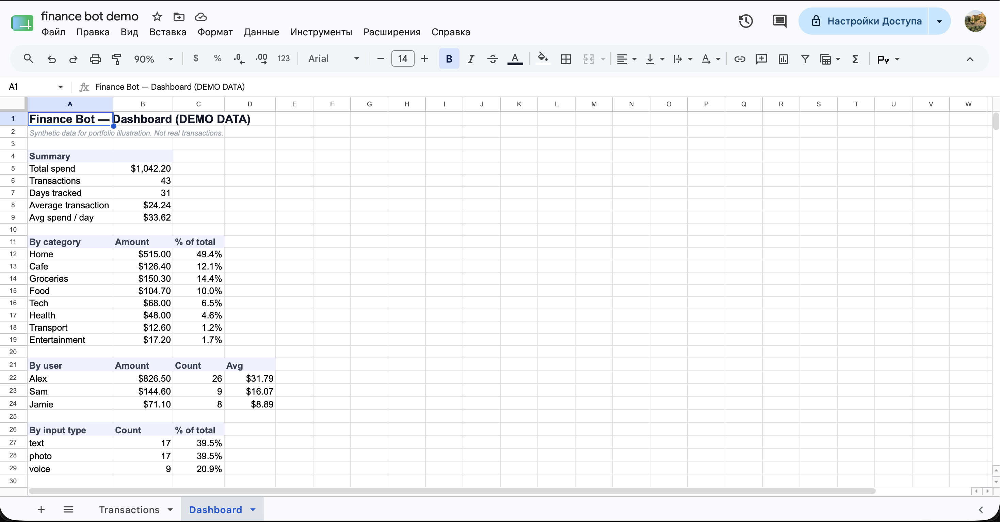

# Telegram Finance Bot — voice, text & photo → live spreadsheet

A personal expense tracker that runs entirely inside Telegram. Send a voice note, a text line, or a photo of a receipt — it gets parsed, categorized, and written to a structured Google Sheet with a live dashboard. No app to install, no subscription.

**▶ [Watch the 60-second demo](https://www.loom.com/share/ec8f8b972f804c2d95acab6e4171b2f0)**

**Built by a non-engineer.** I don't write code. I designed the logic, the data model, and the automation flow, and orchestrated AI models to do the parsing. The point of this repo is to show how an operator thinks about turning a messy real-world problem into a working system.

---

## The problem

I never knew how much I spent per month. Every expense-tracking app meant downloading something, learning a new interface, and usually paying for a subscription — so I never stuck with any of them.

But I'm in Telegram all day anyway. So I built the tracker where I already live: two taps from any chat, send whatever's fastest in the moment — a voice note while walking, a quick text, or a photo of a receipt — and it's logged. Now I actually know where my money goes.

---

## What it does

- **Three input types, one bot.** Voice notes, plain text, and receipt photos all flow into the same pipeline.
- **AI parsing.** Audio is transcribed; receipt photos are read by a vision model; everything is parsed into structured fields (amount, category, item, store).
- **Auto-categorization.** Each transaction is sorted into one of ~15 spending categories.
- **Structured storage.** Clean rows in Google Sheets: date, person, amount, category, description, store, input type.
- **Live dashboard.** Totals, spend-by-category with percentages, spend-per-person, average transaction, and a breakdown of which input type people actually use.
- **Multi-user with access control.** A built-in whitelist gates access — unknown users are denied, approved users are added to the sheet. Designed for more than one person from the start.

---

## Results (first 31 days in production)

| Metric | Value |
|---|---|
| Transactions logged | **254** |
| Active users | **3** (me + two family members) |
| Days in production | **31** |
| Spending categories tracked | **~15** |
| Input mix | text **131** · photo **108** · voice **23** |

The input mix is the part I'm proudest of: all three channels get real use. The bot isn't a demo with one feature that works — people reach for whichever input is fastest in the moment, and all three land in the same clean dataset.

> Real financial figures are kept private. The numbers above are usage metrics; the screenshots below use synthetic demo data.


*Live dashboard — totals, spend by category, by user, and by input type.*


*Transaction log — every entry parsed into structured fields, tagged by input source (text / photo / voice).*

---

## How it works

```
Telegram message
      │
      ▼
[Access control]  ── unknown user ──▶ denied / added to whitelist
      │ approved
      ▼
   [Switch] ── routes by message type ──┐
      │              │                  │
    voice          text               photo
      │              │                  │
      ▼              │                  ▼
 transcribe          │            vision model
 (speech→text)       │           (reads receipt)
      │              │                  │
      └──────────────┼──────────────────┘
                     ▼
            [AI parser — Claude]
        extracts: amount, category,
           item, store, person
                     │
                     ▼
        [JavaScript post-processing
            + validation / routing]
                     │
                     ▼
          Append row → Google Sheet
                     │
                     ▼
        Confirmation back to Telegram
```

**Stack**
- **Telegram** — interface (trigger + replies)
- **n8n** (self-hosted on a VPS) — orchestration
- **OpenAI** — audio transcription
- **Claude** — vision (receipt reading) + text parsing into structured fields
- **JavaScript node** — post-processing, validation, conditional routing
- **Google Sheets** — storage + dashboard

The flow is built as a visual automation in n8n. Access control sits at the very front, message-type routing in the middle, a hybrid AI layer (OpenAI for audio, Claude for vision + parsing) does the understanding, and a code step validates before anything is written.

---

## Why I built it this way (operator notes)

- **Meet users where they are.** The hardest part of any tracker is the habit. Putting it inside Telegram removed the friction entirely — no new app, no context switch.
- **Built for more than one user from day one.** The whitelist and per-person fields weren't an afterthought; the data model assumes multiple people from the start, which is why adding family members was trivial.
- **Prove the manual flow before automating.** Every step started as the simplest version that worked, then got hardened — validation and routing were added once I saw where real messages broke.
- **Right model for the job.** Audio goes to a transcription model, images to a vision model, structured extraction to Claude. Not one tool forced to do everything.

---

## What's next

A multi-user version is in progress — turning this from a personal tool into a system several people can run independently, each with their own private tracker.

---

*Built and maintained by Egor — AI operator. I turn messy, real-world workflows into working systems. X: [@egabuild](https://x.com/egabuild)*
